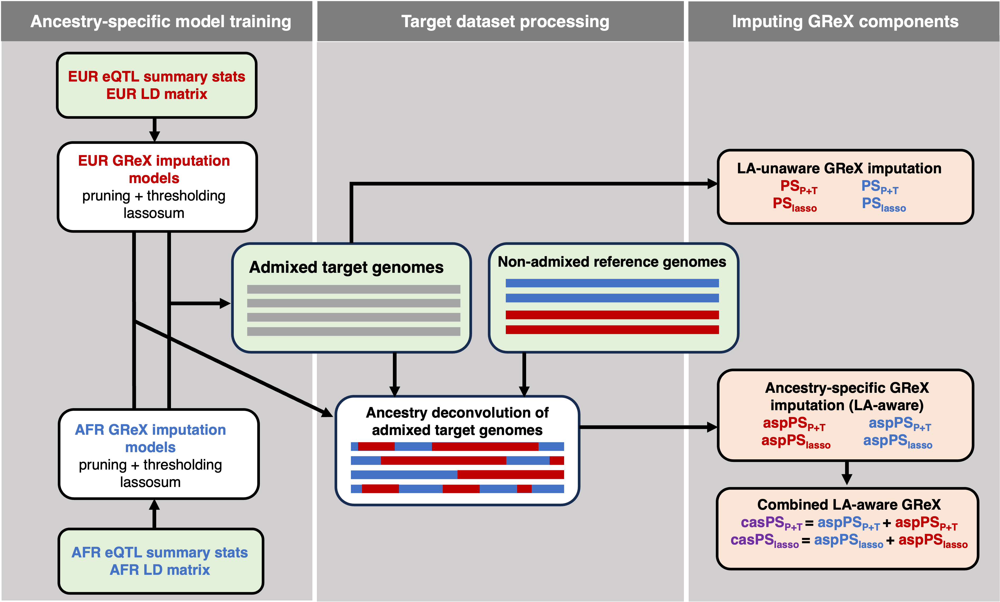

# CADET: Enhanced transcriptome-wide association analyses in admixed samples using eQTL summary data 

## Introduction

<p align="center">
  
</p>

CADET is a tool for conducting powerful transcriptome-wide association studies (TWAS) in admixed populations by integrating local ancestry (LA) information and summary-level eQTL data from ancestrally diverse reference panels. CADET predicts local ancestry-aware genetically regulated gene expression (GReX) by combining polygenic risk score (PRS) models with eQTL summary statistics, without requiring individual-level genotype or expression data. This enables downstream TWAS to identify gene-phenotype associations while accounting for possible ancestry-specific genetic regulation.

CADET leverages local ancestry to capture ancestry-dependent architecture of gene expression, improving the relevance and accuracy of TWAS in admixed populations. With this software, you can perform the following core steps:
1.	Train PRS models of gene expression using eQTL summary statistics via:
    - Pruning and thresholding (P+T), or
    - Lassosum
2.	Impute GReX (both LA-aware and LA-unaware) for target admixed individuals
3.	Test gene-phenotype associations via TWAS using the imputed GReX

## Installation 

First, download all software and example files using:

```bash
git clone https://github.com/staylorhead/CADET.git
```

### Dependencies
CADET depends opon successful prior installation of:
- [R](https://www.r-project.org/) and the following packages
    - [lassosum](https://github.com/tshmak/lassosum)
    - [fdrtool](https://cran.r-project.org/web/packages/fdrtool/index.html)
    - [data.table](https://cran.r-project.org/web/packages/data.table/index.html)
    - [ACAT](https://github.com/yaowuliu/ACAT)
- [BGZIP](http://www.htslib.org/doc/bgzip.html)
- [TABIX](http://www.htslib.org/doc/tabix.html)
- [PLINK 1.9](https://www.cog-genomics.org/plink/)
- Python modules/libraries
    - [pandas 1.4.4](https://pandas.pydata.org)
    - [scipy 1.7.3](https://scipy.org)
    - [numpy 1.21.5](https://numpy.org)
    - [pysam 0.19.1](https://pysam.readthedocs.io/en/latest/api.html) 

Here is some example code to create a Python environment for CADET:

```bash
# create environment 
conda create --name cadet python=3.9 pandas=1.4.4 numpy=1.21.5 scipy=1.7.3 pip
# deactivate conda environment
conda deactivate

 # activate the environment
conda activate cadet

# install pysam
pip install pysam

# deactivate the environment
conda deactivate
```

## Required Input Files
1. **Gene Annotation File**
  - Tab-delimited with the following required columns
    - *CHROM*: Chromosome number as integer (e.g. 4 instead of chr4)
    - *GeneStart*: Start coordinate of the gene. These must match the build of VCF file and eQTL summary statistics.
    - *GeneEnd*: End coordinate of the gene. These must match the build of VCF file and eQTL summary statistics.
    - *TargetID*: Gene identifier (e.g., Ensembl gene ID)
2. **eQTL Summary Statistic Files (2)**
  - Tab-delimited (one file per parent ancestry) with the following required columns
    - *CHROM*: Chromosome number as integer (e.g. 4 instead of chr4)
    - *POS*: Genomic position of the variant (base pair coordinate). These must match the build of VCF file and annotation file.
    - *A1*: Effect allele
    - *A2*: Non-effect (reference) allele
    - *Beta*: Estimated effect size of allele A1 on gene expression relative to A2
    - *P*: p-value of eQTL association
    - *TargetID*: Gene identifier
    - *N*: Sample size used for estimating the association
3. **Phased VCF File of Target Adixed Genomes with LA Information**
    - VCF file with phased, admixed target genotypes and the estimated local ancestry for each allele. This file should follow the format of [FLARE](https://github.com/browning-lab/flare?tab=readme-ov-file#output-files) output VCF files. The two parent ancestries should be coded using integers 0/1. This notation will be assumed across all CADET scripts.
    - The ID field for each variant should take the pattern: chr_pos_ref_alt.
    - The build of this VCF file should again match that of the gene annotation file and eQTL summary statistics.
    
| #CHROM | POS | ID       | REF | ALT | ... | FORMAT     | SAMP1     |
|-------|-----|----------|-----|-----|-----|-------------|-----------|
| 4     | 1   | 4_1_T_C  | T   | C   | ... | GT:AN1:AN2  | 0&#124;0:0:1  |
4. **Allele Frequency Files (2)**
  - Tab-delimited (one file per parent ancestry) with the following required columns
    - *ID*: Variant ID in the pattern: chr_pos_ref_alt
    - *MAF*: Allele frequency of the alternative allele in a given parent ancestry (0 or 1)
5. **Phenotype File of Target Admixed Samples**
  - Tab-delimited with K+1 required columns, where K is the number of phenotypes you are testing in the TWAS
    - *SampID*: Sample IDs matching those included in the VCF file
    - *Phen1*: Phenotype values. These may be numeric or binary. If it is a binary trait, these must be stored as 0/1 integer values.
  - Include further columns for additional phenotypes making sure that each column name is unique.
   
## Example Code

```bash
module load R
module load tabix
module load plink # v1.9
conda activate cadet

# Set the location of the CADET source directory
DIR="/home/sfisch3/CADET"

# Set the location of user input files
VCF="/home/sfisch3/CADET/Example/flare_geno_anc.vcf"
PHENO="/home/sfisch3/CADET/Example/twas_phenotypes.txt"
ANNO="/home/sfisch3/CADET/Example/anno.txt"
EQTL_SS_ANC0="${DIR}/Example/eQTLSumStatsAnc0.txt"
EQTL_SS_ANC1="${DIR}/Example/eQTLSumStatsAnc1.txt"
MAF_ANC0=${DIR}/Example/mafAnc0.txt
MAF_ANC1=${DIR}/Example/mafAnc1.txt

# First create binary files of target VCF
plink \
  --vcf ${VCF} \
  --double-id \
  --make-bed \
  --keep-allele-order \
  --out ${DIR}/Example/geno

################################################################
# (1) Train eQTL weights in ancestry 0, e.g., AFR
################################################################
python3 ${DIR}/training.py \
--anno_file=${ANNO} \ # Path to gene annotation file
--geno_dir=${DIR}/Example/geno \ # Path to binary files created above in plink call
--out_dir=${DIR}/Example/Output/Anc0_grex_models \ # Path to output directory
--sst_file=${EQTL_SS_ANC0} \ # eQTL summary statistic file of ancestry 0
--lassosum_LD_block="AFR.hg38" \ # lassosum LD block: one of "EUR.hg19", "AFR.hg19", "ASN.hg19", "EUR.hg38", "AFR.hg38", "ASN.hg38"
--r2=0.99 \ # LD-clumping threshold 
--window=1000000 \ # Window size around gene
--models=PT,lassosum \ # PRS models to train for imputing gene expression
--pt=0.001,0.05 \ # P-value threshold if training P+T clumping and thresholding models
--thread=1 \ # Number of threads
--script_dir=${DIR} \ # Path to CADET source directory
--seed=123 # Seed

################################################################
# (2) Train eQTL weights in ancestry 1, e.g., EUR
################################################################

python3 ${DIR}/training.py \
--anno_file=${ANNO} \
--geno_dir=${DIR}/Example/geno \
--out_dir=${DIR}/Example/Output/Anc1_grex_models \
--sst_file=${EQTL_SS_ANC1} \
--lassosum_LD_block="EUR.hg38" \
--r2=0.99 \
--window=1000000 \
--models=PT,lassosum \
--pt=0.001,0.05 \
--thread=1 \
--script_dir=${DIR} \
--seed=123

################################################################
# (3) Impute GReX for genes on a single chromosome
# This can fed into a loop over all 22 autosomes
################################################################

Rscript ${DIR}/imputing.R \
--chrom=4 \ # Chromsome 
--anc0_models_dir=${DIR}/Example/Output/Anc0_grex_models \ # Path to directory of ancestry 0 GReX weights
--anc1_models_dir=${DIR}/Example/Output/Anc1_grex_models \ # Path to directory of ancestry 1 GReX weights
--models=PT,lassosum \
--pt=0.001,0.05 \
--vcf_file=${VCF} \
--anno_file=${ANNO} \
--maf_anc0=${MAF_ANC0} \
--maf_anc1=${MAF_ANC1} \
--out_dir=${DIR}/Example/Output/Imputed_grex # Path to output directory

################################################################
# (4) Perform TWAS and p-value aggregation
# This can loop over all 22 autosomes and all phenotypes
################################################################

for pheno_num in 1 2; do
  Rscript ${DIR}/twas.R \
    --chrom=4 \
    --pheno_num=${pheno_num} \
    --models=PT,lassosum \
    --pt=0.001,0.05 \
    --pheno_file=${PHENO} \
    --grex_dir=${DIR}/Example/Output/Imputed_grex \
    --anno_file=${ANNO} \
    --out_dir=${DIR}/Example/Output/TWAS
done
```
## Output Files

## Citation

If you use CADET in your research, please cite the following article:

> Head, S. T., Dai, Q., Schildkraut, J., Cutler, D. J., Yang, J., & Epstein, M. P. (2024). *CADET: Enhanced transcriptome-wide association analyses in admixed samples using eQTL summary data.* bioRxiv. https://doi.org/10.1101/2024.10.21.619441

CADET code also depends on the [OTTERS](https://github.com/daiqile96/OTTERS) framework, and we gratefully acknowledge these authors' contribution. 

## Contact

For questions or issues related to this software, please contact Taylor Head (sthead@mdanderson.org).
